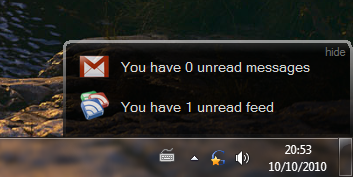
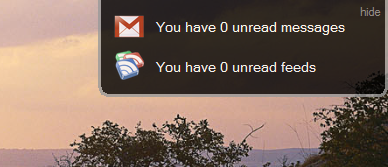
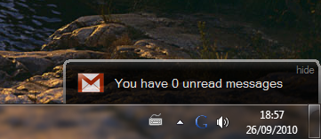
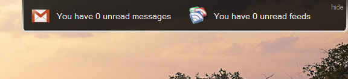
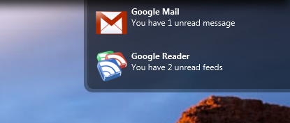
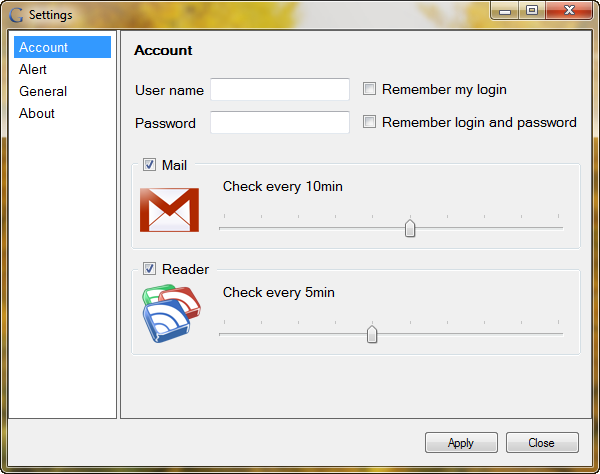
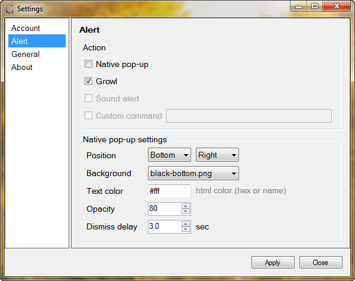
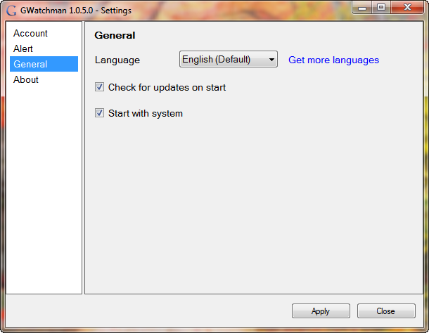
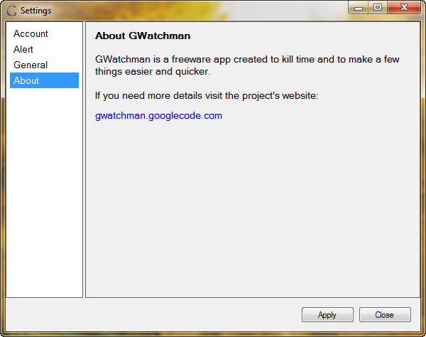

## Pop-ups ##

| **Native Popup - bottom** | **Native Popup - top** |
|:-------------------------:|:----------------------:|
|  |  |
| **Native Popup - single** | **Native Popup - wide** |
|  |  |
| **Growl Popup** |
|  |

## Settings Dialog ##
| **Account settings** | **Alert Settings** |
|:--------------------:|:------------------:|
|  |  |
| **General settings** | **About** |
|  |  |
